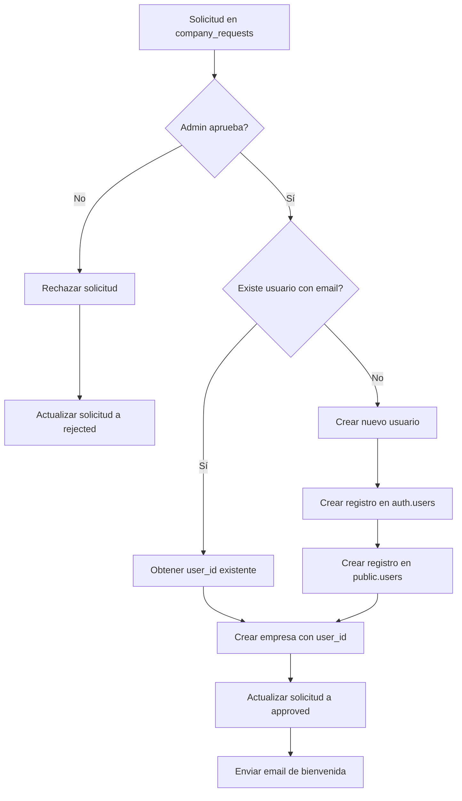

# Plan: Corrección del Módulo de Empresas y Flujo de Aprobación

## Problemas Identificados

### 1. Tarjetas de Stats en 0
**Causa**: Las políticas RLS no están aplicadas en la base de datos. El archivo SQL fue creado pero no ejecutado en Supabase.

**Solución**: Ejecutar el migration SQL en Supabase Dashboard.

### 2. Dos Filtros en el Módulo
**Análisis**: Existen dos filtros diferentes con propósitos distintos:
- `activeTab` (línea 66): Para cambiar entre vistas principales (Empresas, Solicitudes, Activas, Suspendidas)
- `requestFilter` (línea 69): Para filtrar solicitudes por estado (Todas, Pendientes, Aprobadas, Rechazadas)

**Problema**: Esto puede ser confuso para el usuario. Se muestra el filtro de solicitudes incluso cuando no está en la tab de solicitudes.

### 3. Flujo de Aprobación Incompleto
**Problema Crítico**: La tabla `companies` tiene `user_id uuid not null` como campo obligatorio, pero cuando se aprueba una solicitud:
- No existe un usuario creado para el propietario
- El código actual intenta crear la empresa sin `user_id`

**Esquema de la tabla companies**:
```sql
user_id uuid not null,
constraint companies_user_id_fkey foreign KEY (user_id) references users (id) on delete CASCADE
```

## Flujo Correcto de Aprobación

### Opción A: Crear Usuario Automáticamente (Recomendada)
```
1. Admin aprueba solicitud
2. Sistema crea usuario en auth.users con email de la solicitud
3. Sistema crea registro en public.users con rol 'company'
4. Sistema crea empresa con user_id del nuevo usuario
5. Sistema envía email de invitación para establecer contraseña
6. Usuario puede acceder a su panel de empresa
```

### Opción B: Requerir Usuario Existente
```
1. El solicitante debe estar registrado como usuario
2. Al aprobar, se vincula la empresa al usuario existente
3. Si no existe usuario, mostrar error
```

## Plan de Implementación

### Fase 1: Aplicar RLS Policies (Inmediato)
1. Ir a Supabase Dashboard → SQL Editor
2. Ejecutar el contenido de `supabase-fix-company-requests-rls.sql`
3. Verificar que los datos se cargan correctamente

### Fase 2: Corregir Filtros del UI
1. Mostrar `requestFilter` solo cuando `activeTab === 'requests'`
2. Mejorar la UX con indicadores visuales claros

### Fase 3: Implementar Flujo de Aprobación Completo
1. Modificar `useApproveRequest` para:
   - Verificar si existe usuario con el email
   - Si no existe, crear usuario con `supabase.auth.admin.createUser()`
   - Crear registro en `public.users`
   - Crear empresa con el `user_id`
   - Enviar email de invitación

### Fase 4: Crear Función RPC en Supabase
```sql
CREATE OR REPLACE FUNCTION public.approve_company_request(
  request_id UUID,
  reviewer_notes TEXT DEFAULT NULL
)
RETURNS JSON
LANGUAGE plpgsql
SECURITY DEFINER
AS $$
DECLARE
  v_request RECORD;
  v_user_id UUID;
  v_company_id UUID;
  v_slug TEXT;
BEGIN
  -- Obtener la solicitud
  SELECT * INTO v_request FROM company_requests WHERE id = request_id;
  
  IF NOT FOUND THEN
    RETURN json_build_object('success', false, 'error', 'Request not found');
  END IF;
  
  -- Verificar si el usuario ya existe
  SELECT id INTO v_user_id FROM public.users WHERE email = v_request.email;
  
  -- Si no existe, crear usuario (requiere auth.admin)
  IF v_user_id IS NULL THEN
    -- Insertar en auth.users se hace desde el backend
    -- Por ahora, crear en public.users
    INSERT INTO public.users (id, email, full_name, role, is_active)
    VALUES (
      gen_random_uuid(),
      v_request.email,
      v_request.owner_name,
      'company',
      true
    ) RETURNING id INTO v_user_id;
  END IF;
  
  -- Generar slug único
  v_slug := lower(regexp_replace(v_request.business_name, '[^a-z0-9]+', '-', 'gi'));
  
  -- Crear empresa
  INSERT INTO public.companies (
    user_id, company_name, slug, email, phone, 
    business_type, status, is_active, is_verified, plan
  ) VALUES (
    v_user_id, v_request.business_name, v_slug, v_request.email, v_request.phone,
    v_request.business_type, 'active', true, true, 'basic'
  ) RETURNING id INTO v_company_id;
  
  -- Actualizar solicitud
  UPDATE company_requests
  SET status = 'approved', reviewed_by = auth.uid(), reviewed_at = now()
  WHERE id = request_id;
  
  RETURN json_build_object(
    'success', true,
    'company_id', v_company_id,
    'user_id', v_user_id
  );
END;
$$;
```

## Archivos a Modificar

1. **`supabase-fix-company-requests-rls.sql`** - Ya creado, necesita ejecutarse
2. **`src/hooks/useCompanyRequests.ts`** - Modificar `useApproveRequest`
3. **`src/pages/admin/companies/CompaniesListPage.tsx`** - Corregir filtros
4. **Nuevo**: Función RPC en Supabase para aprobación completa

## Diagrama del Flujo



## Próximos Pasos

1. **Ejecutar SQL de RLS** - El usuario debe hacerlo manualmente en Supabase
2. **Implementar correcciones de código** - Cambiar a modo Code
3. **Probar flujo completo** - Crear solicitud, aprobar, verificar empresa creada
