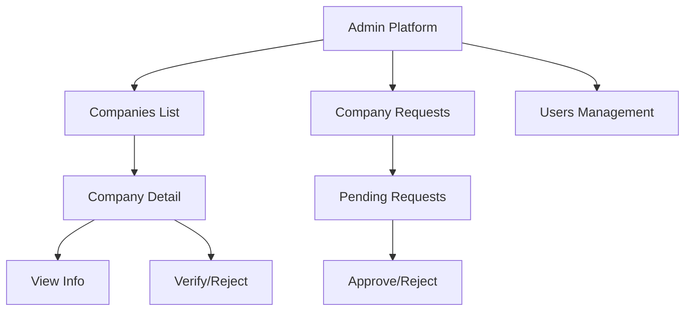
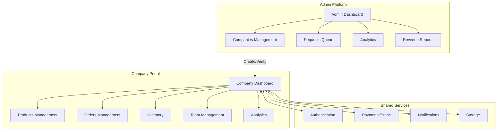
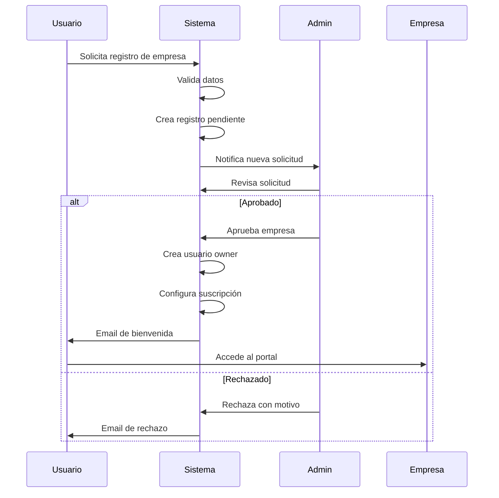
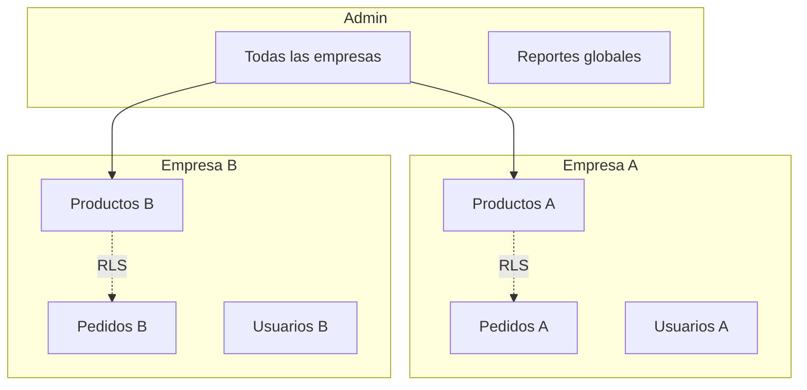

# Arquitectura de Administración de Empresas Afiliadas

## 📋 Resumen Ejecutivo

Este documento describe la arquitectura óptima para la gestión de empresas afiliadas en GabyCosmetics Marketplace, basándose en la infraestructura existente y los requisitos funcionales.

---

## 🏗️ Arquitectura Actual vs. Propuesta

### Estado Actual



### Arquitectura Propuesta



---

## 📊 Flujo de Registro de Empresa

### Proceso Completo



---

## 🗃️ Estructura de Datos

### Tablas Principales

| Tabla | Propósito | Relaciones |
|-------|-----------|------------|
| `companies` | Datos de la empresa | users, subscriptions, products |
| `company_users` | Empleados de la empresa | companies, auth.users |
| `company_invitations` | Invitaciones pendientes | companies |
| `subscriptions` | Planes y pagos | companies |
| `company_requests` | Solicitudes de registro | - |

### Campos Clave de Empresa

```sql
companies (
  id UUID PRIMARY KEY,
  company_name VARCHAR NOT NULL,
  slug VARCHAR UNIQUE,
  email VARCHAR UNIQUE,
  phone VARCHAR,
  logo_url TEXT,
  cover_image_url TEXT,
  description TEXT,
  
  -- Estado
  status VARCHAR DEFAULT 'pending', -- pending, approved, rejected, suspended, active
  is_verified BOOLEAN DEFAULT false,
  is_active BOOLEAN DEFAULT true,
  
  -- Plan
  plan VARCHAR DEFAULT 'basic', -- basic, premium, enterprise
  
  -- Datos fiscales
  tax_id VARCHAR,
  business_type VARCHAR,
  fiscal_address JSONB,
  
  -- Configuración
  settings JSONB DEFAULT '{}',
  social_links JSONB DEFAULT '{}',
  metadata JSONB DEFAULT '{}',
  
  -- Auditoría
  created_at TIMESTAMPTZ,
  updated_at TIMESTAMPTZ,
  approved_at TIMESTAMPTZ,
  approved_by UUID
)
```

---

## 👥 Sistema de Roles y Permisos

### Matriz de Permisos

| Rol | Productos | Pedidos | Inventario | Usuarios | Reportes | Config |
|-----|-----------|---------|------------|----------|----------|--------|
| Owner | CRUD | CRUD | CRUD | CRUD | All | All |
| Admin | CRUD | CRUD | CRUD | CRU | All | All |
| Product Manager | CRU | R | RU | - | R | R |
| Inventory Manager | R | R | CRUD | - | R | R |
| Support | R | CRU | R | - | R | - |
| Marketing | R | R | - | - | R | - |
| Sales | R | CRU | R | - | R | - |
| Viewer | R | R | R | - | R | - |

### Implementación de Permisos

```typescript
// Verificación en frontend
const canCreateProduct = hasPermission(userPermissions, 'products:write');

// Verificación en backend (RLS)
CREATE POLICY "company_users_can_insert_products" ON products
  FOR INSERT
  WITH CHECK (
    company_id IN (
      SELECT company_id FROM company_users 
      WHERE user_id = auth.uid() 
      AND status = 'active'
      AND permissions::text[] @> ARRAY['products:write']
    )
  );
```

---

## 🏢 Portal de Empresa

### Dashboard Principal

```
┌─────────────────────────────────────────────────────────────────┐
│  Dashboard de [Nombre Empresa]                    Plan: Premium │
├─────────────────────────────────────────────────────────────────┤
│                                                                 │
│  ┌──────────┐  ┌──────────┐  ┌──────────┐  ┌──────────┐       │
│  │ Ventas   │  │ Pedidos  │  │ Productos│  │ Stock    │       │
│  │ $12,450  │  │ 156      │  │ 48       │  │ 3 bajos  │       │
│  │ +12%     │  │ +8%      │  │ Activos  │  │ Alertas  │       │
│  └──────────┘  └──────────┘  └──────────┘  └──────────┘       │
│                                                                 │
│  ┌─────────────────────────────────────────────────────────┐   │
│  │ Gráfico de Ventas (últimos 30 días)                     │   │
│  │                                                          │   │
│  │    📈                                                    │   │
│  │                                                          │   │
│  └─────────────────────────────────────────────────────────┘   │
│                                                                 │
│  ┌────────────────────┐  ┌────────────────────┐                │
│  │ Pedidos Recientes  │  │ Productos Top      │                │
│  │ • #1234 - $45.00   │  │ 1. Shampoo X       │                │
│  │ • #1233 - $32.50   │  │ 2. Crema Y         │                │
│  │ • #1232 - $78.00   │  │ 3. Acondicionador  │                │
│  └────────────────────┘  └────────────────────┘                │
└─────────────────────────────────────────────────────────────────┘
```

### Menú de Navegación

| Sección | Descripción | Permisos |
|---------|-------------|----------|
| Dashboard | Resumen de métricas | Todos |
| Productos | CRUD de productos | products:* |
| Pedidos | Gestión de órdenes | orders:* |
| Inventario | Control de stock | inventory:* |
| Clientes | Base de clientes | customers:* |
| Analíticas | Reportes y métricas | analytics:read |
| Equipo | Gestión de usuarios | users:* |
| Configuración | Ajustes de empresa | settings:* |
| Facturación | Pagos y suscripción | billing:* |

---

## 🔐 Seguridad y Aislamiento

### Row Level Security (RLS)

```sql
-- Política para productos: solo ver productos de su empresa
CREATE POLICY "company_users_view_own_products" ON products
  FOR SELECT
  USING (
    company_id IN (
      SELECT company_id FROM company_users 
      WHERE user_id = auth.uid() AND status = 'active'
    )
  );

-- Política para pedidos: solo ver pedidos de su empresa
CREATE POLICY "company_users_view_own_orders" ON orders
  FOR SELECT
  USING (
    company_id IN (
      SELECT company_id FROM company_users 
      WHERE user_id = auth.uid() AND status = 'active'
    )
  );
```

### Aislamiento de Datos



---

## 💳 Sistema de Suscripciones

### Planes y Límites

| Plan | Precio | Productos | Usuarios | Storage | Órdenes/mes |
|------|--------|-----------|----------|---------|-------------|
| Básico | $29/mes | 100 | 1 | 5 GB | 500 |
| Premium | $79/mes | 1,000 | 5 | 50 GB | 5,000 |
| Enterprise | $199/mes | ∞ | ∞ | 1 TB | ∞ |

### Integración con Stripe

```typescript
// Crear suscripción
async function createSubscription(companyId: string, plan: SubscriptionPlan) {
  const stripeCustomer = await stripe.customers.create({
    email: company.email,
    metadata: { companyId }
  });
  
  const subscription = await stripe.subscriptions.create({
    customer: stripeCustomer.id,
    items: [{ price: STRIPE_PRICES[plan] }],
    metadata: { companyId }
  });
  
  // Guardar en base de datos
  await supabase.from('subscriptions').insert({
    company_id: companyId,
    plan,
    stripe_customer_id: stripeCustomer.id,
    stripe_subscription_id: subscription.id,
    status: 'active'
  });
}
```

---

## 📈 Métricas y Reportes

### KPIs por Empresa

- **Ventas totales** (período seleccionado)
- **Número de pedidos**
- **Ticket promedio**
- **Productos más vendidos**
- **Tasa de conversión**
- **Stock bajo**

### KPIs de Plataforma (Admin)

- **Total empresas activas**
- **Ingresos por suscripciones**
- **Distribución por plan**
- **Empresas por verificar**
- **Solicitudes pendientes**

---

## 🔄 Flujos de Trabajo Recomendados

### 1. Alta de Nueva Empresa

1. Usuario completa formulario en `/company/register`
2. Sistema crea registro en `company_requests`
3. Admin recibe notificación
4. Admin revisa y aprueba/rechaza
5. Si aprueba:
   - Crear empresa en `companies`
   - Crear usuario owner en `auth.users` y `users`
   - Asociar usuario a empresa en `company_users`
   - Crear suscripción en `subscriptions`
   - Enviar email de bienvenida

### 2. Invitación de Empleado

1. Owner/Admin invita desde `/company/team`
2. Sistema crea registro en `company_invitations`
3. Sistema envía email con link único
4. Empleado acepta y crea cuenta
5. Sistema actualiza `company_users`

### 3. Upgrade de Plan

1. Owner solicita upgrade desde `/company/billing`
2. Sistema verifica límites actuales
3. Sistema crea checkout en Stripe
4. Al completar pago, actualiza `subscriptions` y `companies.plan`
5. Sistema actualiza límites en `subscriptions.limits`

---

## 🚀 Implementación Prioritaria

### Fase 1: Core (Completado)
- [x] Modelo de datos
- [x] Servicio de empresas
- [x] Sistema de tipos
- [x] RLS básico

### Fase 2: Portal de Empresa
- [ ] Dashboard con métricas
- [ ] Gestión de productos propia
- [ ] Vista de pedidos
- [ ] Control de inventario

### Fase 3: Administración
- [ ] Cola de solicitudes
- [ ] Verificación de empresas
- [ ] Gestión de usuarios
- [ ] Reportes globales

### Fase 4: Monetización
- [ ] Integración Stripe completa
- [ ] Portal de facturación
- [ ] Webhooks de pago
- [ ] Límites por plan

---

## 📝 Notas Técnicas

### Consideraciones

1. **Escalabilidad**: Usar particionamiento por empresa para tablas grandes
2. **Seguridad**: Siempre usar RLS, nunca confiar solo en frontend
3. **Performance**: Cache de permisos en frontend, invalidar on-change
4. **Auditoría**: Log de todas las acciones administrativas

### Endpoints Necesarios

```
POST   /api/companies/register     - Registro de empresa
GET    /api/companies              - Lista empresas (admin)
GET    /api/companies/:id          - Detalle empresa
PUT    /api/companies/:id          - Actualizar empresa
POST   /api/companies/:id/verify   - Verificar empresa
POST   /api/companies/:id/suspend  - Suspender empresa

GET    /api/company/dashboard      - Dashboard empresa actual
GET    /api/company/products       - Productos empresa actual
GET    /api/company/orders         - Pedidos empresa actual
POST   /api/company/invite         - Invitar usuario
```
