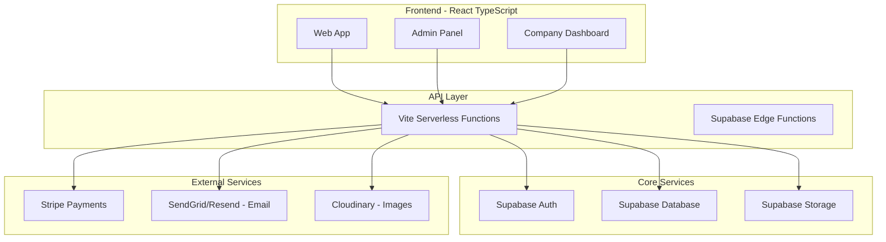
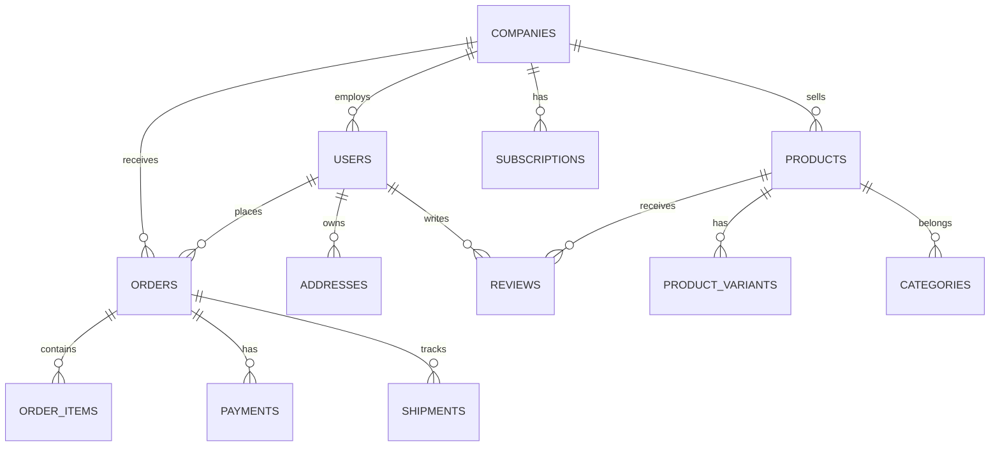

# Plan de Desarrollo: E-Commerce Marketplace Empresarial

## Resumen Ejecutivo

Este documento presenta un plan maestro para desarrollar una plataforma de e-commerce empresarial escalable tipo marketplace, similar a Amazon, con capacidades multiempresa, roles granulares y arquitectura modular.

---

## Estado Actual del Proyecto

### Tecnologías Actuales
- **Frontend:** React + TypeScript + Vite
- **Estilos:** Tailwind CSS
- **Animaciones:** Framer Motion
- **Backend:** Supabase (PostgreSQL + Auth + Storage)
- **Pagos:** Stripe
- **i18n:** react-i18next
- **Rutas:** React Router DOM

### Estructura Actual
```
src/
├── components/
│   ├── landing/       # Componentes públicos
│   ├── layout/        # Header, Footer
│   ├── checkout/      # Proceso de compra
│   └── ui/            # Componentes reutilizables
├── pages/
│   ├── admin/         # Panel de administración
│   ├── shop/          # Tienda y productos
│   ├── auth/          # Autenticación
│   └── company/       # Dashboard de empresas
├── hooks/             # Custom hooks
├── services/          # Servicios de API
├── store/             # Zustand stores
├── lib/               # Utilidades
└── types/             # Tipos TypeScript
```

---

## Arquitectura del Sistema

### Diagrama de Arquitectura General



### Modelo de Datos Principal



---

## Plan de Implementación por Fases

### **FASE 1: Fundamentos del Marketplace**
**Duración estimada:** 4-6 semanas
**Objetivo:** Establecer arquitectura multiempresa básica

#### 1.1 Sistema de Empresas
- [ ] Tabla `companies` con información completa
- [ ] Registro y verificación de empresas
- [ ] Planes de suscripción (Basic, Premium, Enterprise)
- [ ] Sistema de aprobación de empresas
- [ ] Logo y assets por empresa

#### 1.2 Roles y Permisos
- [ ] Sistema de roles por empresa
- [ ] Roles predefinidos:
  - Super Admin (plataforma)
  - Company Admin
  - Product Manager
  - Inventory Manager
  - Customer Support
  - Marketing Manager
- [ ] Permisos granulares (RBAC)
- [ ] Middleware de autorización

#### 1.3 Estructura de Base de Datos
```sql
-- Empresas
CREATE TABLE companies (
    id UUID PRIMARY KEY DEFAULT gen_random_uuid(),
    name VARCHAR(255) NOT NULL,
    slug VARCHAR(255) UNIQUE NOT NULL,
    email VARCHAR(255) UNIQUE NOT NULL,
    phone VARCHAR(50),
    logo_url TEXT,
    cover_image_url TEXT,
    description TEXT,
    plan VARCHAR(50) DEFAULT 'basic',
    status VARCHAR(50) DEFAULT 'pending', -- pending, approved, rejected, suspended
    tax_id VARCHAR(100),
    business_type VARCHAR(100),
    website_url TEXT,
    social_links JSONB,
    settings JSONB DEFAULT '{}',
    created_at TIMESTAMP WITH TIME ZONE DEFAULT NOW(),
    updated_at TIMESTAMP WITH TIME ZONE DEFAULT NOW()
);

-- Usuarios por empresa (empleados)
CREATE TABLE company_users (
    id UUID PRIMARY KEY DEFAULT gen_random_uuid(),
    company_id UUID REFERENCES companies(id) ON DELETE CASCADE,
    user_id UUID REFERENCES auth.users(id) ON DELETE CASCADE,
    role VARCHAR(100) NOT NULL,
    permissions JSONB DEFAULT '[]',
    status VARCHAR(50) DEFAULT 'active',
    hired_at TIMESTAMP WITH TIME ZONE DEFAULT NOW(),
    UNIQUE(company_id, user_id)
);

-- Planes de suscripción
CREATE TABLE subscriptions (
    id UUID PRIMARY KEY DEFAULT gen_random_uuid(),
    company_id UUID REFERENCES companies(id) ON DELETE CASCADE,
    plan VARCHAR(50) NOT NULL,
    status VARCHAR(50) DEFAULT 'active',
    current_period_start TIMESTAMP WITH TIME ZONE,
    current_period_end TIMESTAMP WITH TIME ZONE,
    stripe_subscription_id VARCHAR(255),
    stripe_customer_id VARCHAR(255),
    created_at TIMESTAMP WITH TIME ZONE DEFAULT NOW()
);
```

---

### **FASE 2: Catálogo de Productos Avanzado**
**Duración estimada:** 4-6 semanas
**Objetivo:** Sistema completo de gestión de productos

#### 2.1 Estructura de Productos
- [ ] CRUD completo de productos
- [ ] Sistema de variantes (tallas, colores, etc.)
- [ ] SKU automático por variante
- [ ] Imágenes múltiples con zoom
- [ ] Videos de productos
- [ ] Documentos adjuntos (manuales, etc.)

#### 2.2 Categorías y Taxonomía
- [ ] Categorías jerárquicas (padre/hijo)
- [ ] Múltiples niveles de categorías
- [ ] Atributos por categoría
- [ ] Filtros dinámicos
- [ ] Búsqueda con facetas

#### 2.3 Inventario
- [ ] Stock por variante
- [ ] Múltiples almacenes
- [ ] Reservas de inventario
- [ ] Alertas de stock bajo
- [ ] Historial de movimientos

#### 2.4 Schema de Base de Datos
```sql
-- Categorías
CREATE TABLE categories (
    id UUID PRIMARY KEY DEFAULT gen_random_uuid(),
    company_id UUID REFERENCES companies(id) ON DELETE CASCADE,
    parent_id UUID REFERENCES categories(id) ON DELETE SET NULL,
    name VARCHAR(255) NOT NULL,
    slug VARCHAR(255) NOT NULL,
    description TEXT,
    image_url TEXT,
    icon VARCHAR(100),
    attributes JSONB DEFAULT '[]', -- Atributos específicos
    sort_order INTEGER DEFAULT 0,
    is_active BOOLEAN DEFAULT true,
    created_at TIMESTAMP WITH TIME ZONE DEFAULT NOW()
);

-- Atributos de categorías
CREATE TABLE category_attributes (
    id UUID PRIMARY KEY DEFAULT gen_random_uuid(),
    category_id UUID REFERENCES categories(id) ON DELETE CASCADE,
    name VARCHAR(255) NOT NULL,
    type VARCHAR(50) NOT NULL, -- text, number, select, boolean
    options JSONB DEFAULT '[]', -- Para select múltiple
    is_required BOOLEAN DEFAULT false,
    sort_order INTEGER DEFAULT 0
);

-- Productos
CREATE TABLE products (
    id UUID PRIMARY KEY DEFAULT gen_random_uuid(),
    company_id UUID REFERENCES companies(id) ON DELETE CASCADE,
    category_id UUID REFERENCES categories(id),
    name VARCHAR(255) NOT NULL,
    name_en VARCHAR(255),
    slug VARCHAR(255) NOT NULL,
    description TEXT,
    description_en TEXT,
    brand VARCHAR(255),
    model VARCHAR(255),
    base_price DECIMAL(12, 2) NOT NULL,
    compare_at_price DECIMAL(12, 2),
    cost_price DECIMAL(12, 2),
    sku_prefix VARCHAR(50),
    barcode VARCHAR(100),
    weight DECIMAL(10, 3),
    dimensions JSONB, -- {length, width, height, unit}
    images JSONB DEFAULT '[]',
    videos JSONB DEFAULT '[]',
    documents JSONB DEFAULT '[]',
    attributes JSONB DEFAULT '{}',
    seo_metadata JSONB DEFAULT '{}',
    status VARCHAR(50) DEFAULT 'draft', -- draft, active, inactive, archived
    is_featured BOOLEAN DEFAULT false,
    is_digital BOOLEAN DEFAULT false,
    has_variants BOOLEAN DEFAULT false,
    total_stock INTEGER DEFAULT 0,
    low_stock_threshold INTEGER DEFAULT 10,
    created_at TIMESTAMP WITH TIME ZONE DEFAULT NOW(),
    updated_at TIMESTAMP WITH TIME ZONE DEFAULT NOW()
);

-- Variantes de productos
CREATE TABLE product_variants (
    id UUID PRIMARY KEY DEFAULT gen_random_uuid(),
    product_id UUID REFERENCES products(id) ON DELETE CASCADE,
    sku VARCHAR(255) UNIQUE NOT NULL,
    name VARCHAR(255),
    price DECIMAL(12, 2) NOT NULL,
    compare_at_price DECIMAL(12, 2),
    cost_price DECIMAL(12, 2),
    barcode VARCHAR(100),
    weight DECIMAL(10, 3),
    dimensions JSONB,
    images JSONB DEFAULT '[]',
    attributes JSONB DEFAULT '{}',
    stock_quantity INTEGER DEFAULT 0,
    stock_reserved INTEGER DEFAULT 0,
    is_available BOOLEAN DEFAULT true,
    sort_order INTEGER DEFAULT 0,
    created_at TIMESTAMP WITH TIME ZONE DEFAULT NOW(),
    updated_at TIMESTAMP WITH TIME ZONE DEFAULT NOW()
);

-- Inventario por almacén
CREATE TABLE warehouse_inventory (
    id UUID PRIMARY KEY DEFAULT gen_random_uuid(),
    variant_id UUID REFERENCES product_variants(id) ON DELETE CASCADE,
    warehouse_id UUID REFERENCES warehouses(id) ON DELETE CASCADE,
    quantity INTEGER DEFAULT 0,
    reserved_quantity INTEGER DEFAULT 0,
    reorder_point INTEGER DEFAULT 10,
    created_at TIMESTAMP WITH TIME ZONE DEFAULT NOW(),
    updated_at TIMESTAMP WITH TIME ZONE DEFAULT NOW(),
    UNIQUE(variant_id, warehouse_id)
);
```

---

### **FASE 3: Sistema de Pedidos Completo**
**Duración estimada:** 4-6 semanas
**Objetivo:** Proceso de compra end-to-end

#### 3.1 Carrito de Compras
- [ ] Carrito persistente
- [ ] Múltiples tiendas en un carrito
- [ ] Cupones de descuento
- [ ] Lista de deseos
- [ ] Comparación de productos

#### 3.2 Checkout
- [ ] Checkout multi-paso
- [ ] Direcciones múltiples
- [ ] Métodos de envío
- [ ] Cálculo de impuestos
- [ ] Resumen de orden

#### 3.3 Gestión de Órdenes
- [ ] Estados de orden
- [ ] Historial de cambios
- [ ] Seguimiento en tiempo real
- [ ] Devoluciones y reembolsos
- [ ] Facturación

#### 3.4 Schema de Órdenes
```sql
-- Direcciones
CREATE TABLE addresses (
    id UUID PRIMARY KEY DEFAULT gen_random_uuid(),
    user_id UUID REFERENCES auth.users(id) ON DELETE CASCADE,
    type VARCHAR(50) DEFAULT 'shipping', -- shipping, billing
    is_default BOOLEAN DEFAULT false,
    first_name VARCHAR(255) NOT NULL,
    last_name VARCHAR(255) NOT NULL,
    company_name VARCHAR(255),
    address_line1 VARCHAR(500) NOT NULL,
    address_line2 VARCHAR(500),
    city VARCHAR(255) NOT NULL,
    state VARCHAR(255),
    postal_code VARCHAR(50) NOT NULL,
    country VARCHAR(100) NOT NULL,
    phone VARCHAR(50),
    instructions TEXT,
    created_at TIMESTAMP WITH TIME ZONE DEFAULT NOW()
);

-- Órdenes
CREATE TABLE orders (
    id UUID PRIMARY KEY DEFAULT gen_random_uuid(),
    order_number VARCHAR(100) UNIQUE NOT NULL,
    user_id UUID REFERENCES auth.users(id) ON DELETE SET NULL,
    company_id UUID REFERENCES companies(id), -- Vendedor principal
    status VARCHAR(50) DEFAULT 'pending',
    subtotal DECIMAL(12, 2) NOT NULL,
    discount_amount DECIMAL(12, 2) DEFAULT 0,
    tax_amount DECIMAL(12, 2) DEFAULT 0,
    shipping_amount DECIMAL(12, 2) DEFAULT 0,
    total DECIMAL(12, 2) NOT NULL,
    currency VARCHAR(10) DEFAULT 'USD',
    coupon_code VARCHAR(100),
    coupon_discount DECIMAL(12, 2) DEFAULT 0,
    shipping_address JSONB NOT NULL,
    billing_address JSONB NOT NULL,
    shipping_method VARCHAR(255),
    shipping_cost DECIMAL(12, 2),
    estimated_delivery DATE,
    notes TEXT,
    metadata JSONB DEFAULT '{}',
    created_at TIMESTAMP WITH TIME ZONE DEFAULT NOW(),
    updated_at TIMESTAMP WITH TIME ZONE DEFAULT NOW()
);

-- Items de orden
CREATE TABLE order_items (
    id UUID PRIMARY KEY DEFAULT gen_random_uuid(),
    order_id UUID REFERENCES orders(id) ON DELETE CASCADE,
    product_id UUID REFERENCES products(id),
    variant_id UUID REFERENCES product_variants(id),
    company_id UUID REFERENCES companies(id),
    name VARCHAR(255) NOT NULL,
    sku VARCHAR(255),
    quantity INTEGER NOT NULL,
    unit_price DECIMAL(12, 2) NOT NULL,
    discount_amount DECIMAL(12, 2) DEFAULT 0,
    tax_amount DECIMAL(12, 2) DEFAULT 0,
    total DECIMAL(12, 2) NOT NULL,
    status VARCHAR(50) DEFAULT 'pending', -- pending, processing, shipped, delivered, cancelled
    tracking_number VARCHAR(255),
    tracking_url TEXT,
    shipped_at TIMESTAMP WITH TIME ZONE,
    delivered_at TIMESTAMP WITH TIME ZONE,
    created_at TIMESTAMP WITH TIME ZONE DEFAULT NOW()
);

-- Historial de estados de orden
CREATE TABLE order_status_history (
    id UUID PRIMARY KEY DEFAULT gen_random_uuid(),
    order_id UUID REFERENCES orders(id) ON DELETE CASCADE,
    status VARCHAR(50) NOT NULL,
    description TEXT,
    created_by UUID REFERENCES auth.users(id),
    created_at TIMESTAMP WITH TIME ZONE DEFAULT NOW()
);
```

---

### **FASE 4: Sistema de Pagos y Facturación**
**Duración estimada:** 3-4 semanas
**Objetivo:** Pagos con división automática

#### 4.1 Integración Stripe
- [ ] Connect para marketplaces
- [ ] Pagos divididos (platform + seller)
- [ ] Comisiones configurables
- [ ] Payouts automáticos
- [ ] Reembolsos

#### 4.2 Facturación
- [ ] Facturas PDF automáticas
- [ ] Facturación electrónica
- [ ] Historial de pagos
- [ ] Conciliación

#### 4.4 Schema de Pagos
```sql
-- Pagos
CREATE TABLE payments (
    id UUID PRIMARY KEY DEFAULT gen_random_uuid(),
    order_id UUID REFERENCES orders(id) ON DELETE CASCADE,
    stripe_payment_intent_id VARCHAR(255) UNIQUE NOT NULL,
    stripe_charge_id VARCHAR(255),
    amount DECIMAL(12, 2) NOT NULL,
    currency VARCHAR(10) DEFAULT 'USD',
    status VARCHAR(50) DEFAULT 'pending', -- pending, succeeded, failed, cancelled, refunded
    payment_method VARCHAR(50),
    paid_at TIMESTAMP WITH TIME ZONE,
    metadata JSONB DEFAULT '{}',
    created_at TIMESTAMP WITH TIME ZONE DEFAULT NOW()
);

-- Transacciones de marketplace (split payments)
CREATE TABLE marketplace_transactions (
    id UUID PRIMARY KEY DEFAULT gen_random_uuid(),
    order_id UUID REFERENCES orders(id) ON DELETE CASCADE,
    payment_id UUID REFERENCES payments(id),
    company_id UUID REFERENCES companies(id),
    amount DECIMAL(12, 2) NOT NULL,
    type VARCHAR(50) NOT NULL, -- platform_fee, seller_payout, commission
    status VARCHAR(50) DEFAULT 'pending',
    stripe_transfer_id VARCHAR(255),
    processed_at TIMESTAMP WITH TIME ZONE,
    created_at TIMESTAMP WITH TIME ZONE DEFAULT NOW()
);
```

---

### **FASE 5: Logística y Envíos**
**Duración estimada:** 3-4 semanas
**Objetivo:** Sistema de envíos completo

#### 5.1 Transportistas
- [ ] Múltiples transportistas
- [ ] Integración con APIs
- [ ] Calculadora de costos
- [ ] Generación de etiquetas
- [ ] Tracking de paquetes

#### 5.2 Almacenes
- [ ] Múltiples almacenes
- [ ] Gestión de stock
- [ ] Transferencias entre almacenes
- [ ] Ubicaciones dentro de almacén

#### 5.4 Schema de Logística
```sql
-- Almacenes
CREATE TABLE warehouses (
    id UUID PRIMARY KEY DEFAULT gen_random_uuid(),
    company_id UUID REFERENCES companies(id) ON DELETE CASCADE,
    name VARCHAR(255) NOT NULL,
    type VARCHAR(50) DEFAULT 'fulfillment', -- fulfillment, dropship
    address JSONB NOT NULL,
    is_active BOOLEAN DEFAULT true,
    is_default BOOLEAN DEFAULT false,
    created_at TIMESTAMP WITH TIME ZONE DEFAULT NOW()
);

-- Envíos
CREATE TABLE shipments (
    id UUID PRIMARY KEY DEFAULT gen_random_uuid(),
    order_id UUID REFERENCES orders(id) ON DELETE CASCADE,
    order_item_id UUID REFERENCES order_items(id),
    company_id UUID REFERENCES companies(id),
    warehouse_id UUID REFERENCES warehouses(id),
    carrier VARCHAR(100) NOT NULL,
    service VARCHAR(100),
    tracking_number VARCHAR(255),
    tracking_url TEXT,
    label_url TEXT,
    cost DECIMAL(12, 2),
    weight DECIMAL(10, 3),
    dimensions JSONB,
    status VARCHAR(50) DEFAULT 'pending', -- pending, label_created, in_transit, out_for_delivery, delivered, exception
    shipped_at TIMESTAMP WITH TIME ZONE,
    estimated_delivery DATE,
    delivered_at TIMESTAMP WITH TIME ZONE,
    events JSONB DEFAULT '[]',
    created_at TIMESTAMP WITH TIME ZONE DEFAULT NOW()
);
```

---

### **FASE 6: Reseñas, Calificaciones y Social**
**Duración estimada:** 2-3 semanas
**Objetivo:** Sistema de confianza

#### 6.1 Reseñas
- [ ] Reseñas de productos
- [ ] Calificaciones por estrellas
- [ ] Fotos en reseñas
- [ ] Preguntas y respuestas
- [ ] Reseñas verificadas

#### 6.2 Reputación
- [ ] Rating de vendedores
- [ ] Criterios de evaluación
- [ ] Incentivos de reseñas
- [ ] Moderación de contenido

#### 6.4 Schema de Reseñas
```sql
-- Reseñas de productos
CREATE TABLE reviews (
    id UUID PRIMARY KEY DEFAULT gen_random_uuid(),
    product_id UUID REFERENCES products(id) ON DELETE CASCADE,
    variant_id UUID REFERENCES product_variants(id),
    user_id UUID REFERENCES auth.users(id) ON DELETE CASCADE,
    order_id UUID REFERENCES orders(id),
    rating INTEGER NOT NULL CHECK (rating >= 1 AND rating <= 5),
    title VARCHAR(255),
    content TEXT NOT NULL,
    images JSONB DEFAULT '[]',
    is_verified_purchase BOOLEAN DEFAULT false,
    is_approved BOOLEAN DEFAULT true,
    helpful_count INTEGER DEFAULT 0,
    response_from_seller TEXT,
    responded_at TIMESTAMP WITH TIME ZONE,
    created_at TIMESTAMP WITH TIME ZONE DEFAULT NOW(),
    updated_at TIMESTAMP WITH TIME ZONE DEFAULT NOW(),
    UNIQUE(product_id, user_id)
);

-- Preguntas y respuestas
CREATE TABLE product_questions (
    id UUID PRIMARY KEY DEFAULT gen_random_uuid(),
    product_id UUID REFERENCES products(id) ON DELETE CASCADE,
    user_id UUID REFERENCES auth.users(id) ON DELETE CASCADE,
    question TEXT NOT NULL,
    answer TEXT,
    answered_by UUID REFERENCES auth.users(id),
    answered_at TIMESTAMP WITH TIME ZONE,
    is_approved BOOLEAN DEFAULT true,
    helpful_count INTEGER DEFAULT 0,
    created_at TIMESTAMP WITH TIME ZONE DEFAULT NOW()
);

-- Votos útiles
CREATE TABLE review_votes (
    id UUID PRIMARY KEY DEFAULT gen_random_uuid(),
    review_id UUID REFERENCES reviews(id) ON DELETE CASCADE,
    user_id UUID REFERENCES auth.users(id) ON DELETE CASCADE,
    is_helpful BOOLEAN NOT NULL,
    created_at TIMESTAMP WITH TIME ZONE DEFAULT NOW(),
    UNIQUE(review_id, user_id)
);
```

---

### **FASE 7: Notificaciones y Comunicación**
**Duración estimada:** 2-3 semanas
**Objetivo:** Sistema de comunicaciones

#### 7.1 Notificaciones
- [ ] Email transaccionales
- [ ] Notificaciones push
- [ ] SMS (opcional)
- [ ] Centro de notificaciones in-app

#### 7.2 Plantillas
- [ ] Confirmación de orden
- [ ] Actualizaciones de envío
- [ ] Reseñas solicitadas
- [ ] Abandono de carrito
- [ ] Bienvenida

#### 7.4 Servicios Recomendados
- **Email:** Resend o SendGrid
- **Push:** Firebase Cloud Messaging
- **SMS:** Twilio

---

### **FASE 8: Analíticas y Reportes**
**Duración estimada:** 3-4 semanas
**Objetivo:** Dashboard de métricas

#### 8.1 Métricas por Empresa
- [ ] Ventas diarias/semanales/mensuales
- [ ] Productos más vendidos
- [ ] Categorías top
- [ ] Clientes recurrentes
- [ ] Ticket promedio

#### 8.2 Analíticas de Plataforma
- [ ] GMV (Gross Merchandise Value)
- [ ] Revenue de plataforma
- [ ] Tasa de conversión
- [ ] CAC y LTV
- [ ] Churn rate

#### 8.3 Reportes
- [ ] Reportes personalizados
- [ ] Exportación a PDF/Excel
- [ ] Scheduled reports
- [ ] Comparaciones período

---

### **FASE 9: Soporte al Cliente**
**Duración estimada:** 2-3 semanas
**Objetivo:** Sistema de soporte

#### 9.1 Tickets
- [ ] Creación de tickets
- [ ] Categorización y prioridades
- [ ] Asignación automática
- [ ] Escalamiento
- [ ] Satisfacción

#### 9.2 Centro de Ayuda
- [ ] Artículos FAQ
- [ ] Categorías de ayuda
- [ ] Búsqueda
- [ ] Chat en vivo (opcional)

#### 9.4 Schema de Tickets
```sql
-- Tickets de soporte
CREATE TABLE support_tickets (
    id UUID PRIMARY KEY DEFAULT gen_random_uuid(),
    ticket_number VARCHAR(100) UNIQUE NOT NULL,
    user_id UUID REFERENCES auth.users(id) ON DELETE SET NULL,
    order_id UUID REFERENCES orders(id),
    company_id UUID REFERENCES companies(id),
    type VARCHAR(100) NOT NULL, -- order, product, billing, technical
    subject VARCHAR(500) NOT NULL,
    description TEXT NOT NULL,
    status VARCHAR(50) DEFAULT 'open', -- open, pending, resolved, closed
    priority VARCHAR(50) DEFAULT 'medium', -- low, medium, high, urgent
    assigned_to UUID REFERENCES auth.users(id),
    first_response_at TIMESTAMP WITH TIME ZONE,
    resolved_at TIMESTAMP WITH TIME ZONE,
    rating INTEGER,
    feedback TEXT,
    created_at TIMESTAMP WITH TIME ZONE DEFAULT NOW(),
    updated_at TIMESTAMP WITH TIME ZONE DEFAULT NOW()
);

-- Mensajes de tickets
CREATE TABLE ticket_messages (
    id UUID PRIMARY KEY DEFAULT gen_random_uuid(),
    ticket_id UUID REFERENCES support_tickets(id) ON DELETE CASCADE,
    sender_id UUID REFERENCES auth.users(id),
    sender_type VARCHAR(50) NOT NULL, -- user, agent, system
    message TEXT NOT NULL,
    attachments JSONB DEFAULT '[]',
    is_internal BOOLEAN DEFAULT false,
    created_at TIMESTAMP WITH TIME ZONE DEFAULT NOW()
);
```

---

## Resumen de Fases y Timeline

| Fase | Módulos | Duración | Prioridad |
|------|---------|----------|-----------|
| 1 | Empresas, Roles, Permisos | 4-6 semanas | 🔴 Alta |
| 2 | Catálogo, Variantes, Inventario | 4-6 semanas | 🔴 Alta |
| 3 | Órdenes, Carrito, Checkout | 4-6 semanas | 🔴 Alta |
| 4 | Pagos (Stripe Connect) | 3-4 semanas | 🔴 Alta |
| 5 | Logística, Envíos | 3-4 semanas | 🟡 Media |
| 6 | Reseñas, Social Proof | 2-3 semanas | 🟡 Media |
| 7 | Notificaciones | 2-3 semanas | 🟡 Media |
| 8 | Analíticas | 3-4 semanas | 🟢 Baja |
| 9 | Soporte al Cliente | 2-3 semanas | 🟢 Baja |

**Total estimado:** 27-35 semanas (6-8 meses)

---

## Prioridades Recomendadas

### Inmediato (Fases 1-4)
1. Sistema multiempresa funcional
2. Catálogo de productos completo
3. Proceso de compra funcional
4. Pagos con Stripe Connect

### Corto Plazo (Fases 5-6)
5. Logística básica
6. Sistema de reseñas

### Mediano Plazo (Fases 7-9)
7. Notificaciones
8. Analíticas
9. Soporte

---

## Próximos Pasos

1. **Revisar y aprobar este plan**
2. **Priorizar módulos a desarrollar**
3. **Comenzar con Fase 1: Sistema de Empresas**
4. **Configurar Supabase para producción**
5. **Implementar incrementally**
