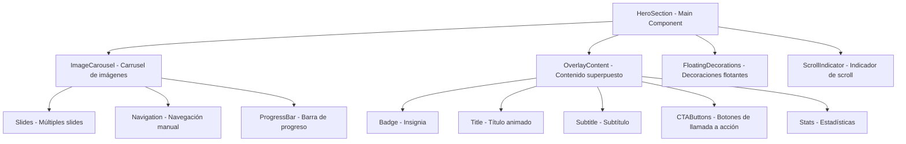

# Plan de Rediseño del Hero Section - Gaby Cosmetics

## Resumen del Proyecto
Rediseño completo del componente HeroSection para hacerlo más moderno, atractivo y visualmente impactante con un carrusel de imágenes que rota automáticamente.

## Requisitos del Usuario
1. ✅ Imágenes relacionadas con productos de belleza que roten cada 4 segundos
2. ✅ Hero a pantalla completa de ancho (full-width)
3. ✅ Diseño moderno y atractivo
4. ✅ Mejoras visuales generales (colores, tipografía, elementos decorativos)

---

## Arquitectura del Nuevo Hero Section

### Estructura de Componentes



### Layout Full-Width

```
┌─────────────────────────────────────────────────────────────┐
│                    HERO SECTION (100vw)                     │
├─────────────────────────────────────────────────────────────┤
│  ┌─────────────────────────────────────────────────────┐    │
│  │              IMAGE CAROUSEL (Background)             │    │
│  │    [Imagen 1] ────► [Imagen 2] ────► [Imagen 3]      │    │
│  │            4 segundos por imagen                     │    │
│  └─────────────────────────────────────────────────────┘    │
│  ┌─────────────────────────────────────────────────────┐    │
│  │              OVERLAY CONTENT (Top Layer)            │    │
│  │  ┌─────────┐                                         │    │
│  │  │  Badge  │   Título Principal                       │    │
│  │  └─────────┘   Subtítulo descriptivo                 │    │
│  │                 Botón CTA Principal                  │    │
│  │                 Botón Secundario                     │    │
│  │                 Estadísticas                          │    │
│  │  ┌─────────────────────────────────────────────────┐ │    │
│  │  │   [★] 500+ Productos  [★] 50K+ Clientes  [★]   │ │    │
│  │  └─────────────────────────────────────────────────┘ │    │
│  └─────────────────────────────────────────────────────┘    │
│  ┌─────────────────────────────────────────────────────┐    │
│  │    DECORATIVE ELEMENTS + FLOATING PARTICLES          │    │
│  └─────────────────────────────────────────────────────┘    │
│                    ▼ Indicador de Scroll                   │
└─────────────────────────────────────────────────────────────┘
```

---

## Componentes a Crear/Modificar

### 1. HeroSection.tsx (Principal)
**Funcionalidades:**
- Contenedor full-width `min-h-screen w-full`
- State para controlar slide actual del carrusel
- `useEffect` para rotación automática cada 4 segundos
- Transiciones suaves entre slides

### 2. ImageCarousel.tsx (Nuevo)
**Props:**
```typescript
interface CarouselProps {
  images: { src: string; alt: string }[];
  interval?: number; // default: 4000ms
}
```

**Funcionalidades:**
- Fade transition entre imágenes
- Slide transition opcional
- Indicadores de posición (dots)
- Progress bar animado
- Navegación manual (opcional)

### 3. OverlayContent.tsx (Nuevo)
**Elementos:**
- Badge con ícono de sparkles
- Título con animación de reveal por palabras
- Subtítulo descriptivo
- Botones CTA con efectos hover avanzados
- Grid de estadísticas con contadores animados

### 4. FloatingDecorations.tsx (Nuevo)
**Elementos:**
- Partículas flotantes con diferentes tamaños
- Formas geométricas decorativas (círculos, flores)
- Efectos de luz/gradient
- Animaciones de movimiento continuo

---

## Especificaciones de Diseño

### Paleta de Colores
```css
/* Colores principales */
--rose-500: #f43f5e;  /* Color de marca */
--rose-600: #e11d48;  /* Color hover */
--amber-400: #fbbf24; /* Acento dorado */
--gray-900: #111827;  /* Texto principal */
--gray-600: #4b5563;  /* Texto secundario */
--white: #ffffff;     /* Fondo overlay */

/* Gradientes */
hero-gradient: linear-gradient(135deg, rose-500 0%, amber-400 100%);
```

### Tipografía
```css
/* Títulos */
font-family: 'Playfair Display', serif;
font-size: 3rem to 5rem;
font-weight: 700;
line-height: 1.1;

/* Subtítulos */
font-family: 'Inter', sans-serif;
font-size: 1.125rem to 1.5rem;
font-weight: 400;
line-height: 1.6;
```

### Animaciones (Framer Motion)

```typescript
// Slide transition
const slideVariants = {
  enter: { opacity: 0, x: 100 },
  center: { opacity: 1, x: 0 },
  exit: { opacity: 0, x: -100 }
};

// Text reveal animation
const textVariants = {
  hidden: { opacity: 0, y: 20 },
  visible: { opacity: 1, y: 0 }
};
```

---

## Imágenes Requeridas

El carrusel necesita las siguientes imágenes en `public/images/hero/`:

### Imágenes Obligatorias (5 recomendadas)
1. **`hero-1.jpg`** - Imagen principal de productos de belleza
2. **`hero-2.jpg`** - Close-up de productos skincare
3. **`hero-3.jpg`** - Imagen de spa/bienestar
4. **`hero-4.jpg`** - Productos naturales/orgánicos
5. **`hero-5.jpg`** - Imagen lifestyle de belleza

### Especificaciones de Imágenes
- **Resolución mínima:** 1920x1080px (Full HD)
- **Formato:** JPG o WebP
- **Calidad:** Alta para加载 rápido
- **Tema:** Belleza, skincare, productos naturales, spa

### Nota Importante
> ⚠️ **Acción requerida:** El usuario debe proporcionar las imágenes de productos de belleza. Sin estas imágenes, el carrusel no podrá funcionar correctamente.

---

## Implementación por Fases

### Fase 1: Estructura Base
- [ ] Crear componentes base del carrusel
- [ ] Implementar sistema de rotación automática
- [ ] Configurar full-width container

### Fase 2: Contenido y Overlay
- [ ] Crear OverlayContent con tipografía mejorada
- [ ] Implementar badge y título animado
- [ ] Añadir botones CTA con efectos hover

### Fase 3: Decoraciones y Animaciones
- [ ] Crear elementos decorativos flotantes
- [ ] Implementar partículas animadas
- [ ] Añadir efectos de luz y sombra

### Fase 4: Estilización Final
- [ ] Ajustar colores y gradientes
- [ ] Optimizar responsive design
- [ ] Testing en diferentes tamaños de pantalla

---

## Archivos a Modificar/Crear

### Archivos Existentes a Modificar
1. `src/components/landing/HeroSection.tsx` - Rediseño completo

### Archivos Nuevos a Crear
1. `src/components/landing/ImageCarousel.tsx`
2. `src/components/landing/OverlayContent.tsx`
3. `src/components/landing/FloatingDecorations.tsx`
4. `src/components/landing/ScrollIndicator.tsx`

### Archivos de Configuración
1. `public/images/hero/` - Carpeta para imágenes

---

## Recursos Adicionales

### Librerías a Utilizar
- **Framer Motion** - Animaciones (ya instalada)
- **Lucide React** - Iconos (ya instalada)
- **Tailwind CSS** - Estilos (ya configurado)

### Fuentes Recomendadas
- **Google Fonts:** Playfair Display (títulos)
- **Google Fonts:** Inter (texto general)

---

## Checklist de Validación

- [ ] El carrusel rota cada 4 segundos correctamente
- [ ] Las transiciones entre slides son suaves
- [ ] El hero es full-width (100vw)
- [ ] El contenido está legible sobre las imágenes
- [ ] Las animaciones son fluidas (60fps)
- [ ] El diseño es responsive (mobile, tablet, desktop)
- [ ] Los botones CTA tienen efectos hover
- [ ] Las estadísticas se muestran correctamente
- [ ] El indicador de scroll funciona
- [ ] Las imágenes de productos están cargadas

---

## Próximos Pasos

1. ✅ Aprobar este plan
2. Proporcionar imágenes de productos de belleza
3. Cambiar a modo **Code** para implementación
4. Crear componentes del carrusel
5. Implementar animaciones y decoraciones
6. Testing y ajustes finales

---

## Notas del Arquitecto

- El diseño actual ya tiene una buena base con Framer Motion
- El nuevo diseño mantendrá la accesibilidad y performance
- Se recomienda usar imágenes de alta calidad para impacto visual
- El carrusel puede pausarse en hover para mejor UX
- Considerar lazy loading para las imágenes del carrusel
