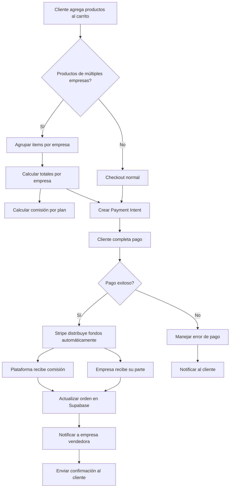
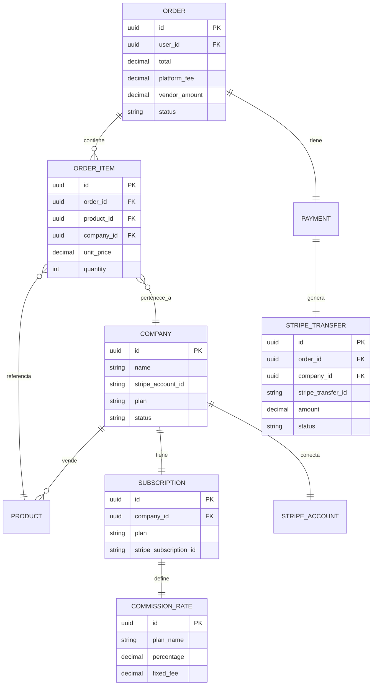
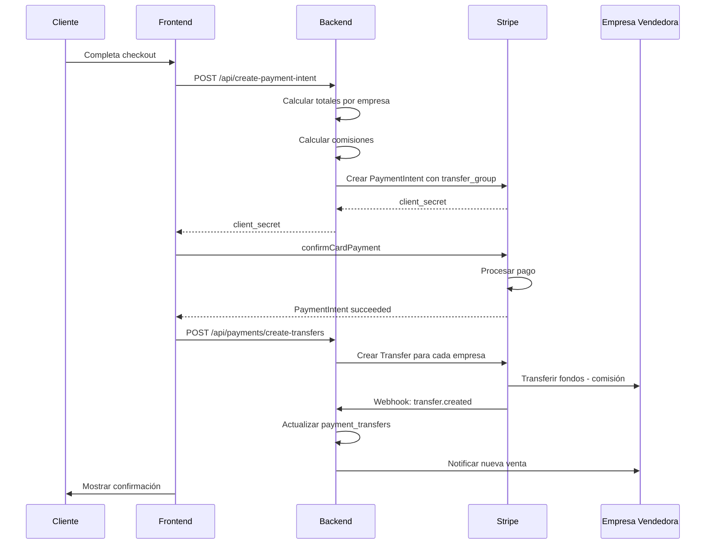

# 🔐 Plan Detallado: Sistema de Pagos Seguro para Marketplace

**Fecha:** Febrero 2026  
**Objetivo:** Implementar un sistema de pagos seguro para todas las partes (clientes, empresas vendedoras, plataforma) usando Stripe Connect.
**Última actualización:** 23 de Febrero 2026

---

## 📊 RESUMEN EJECUTIVO

### Modelo de Negocio Confirmado
- **Tipo:** Marketplace con múltiples vendedores
- **Distribución:** Stripe Connect (automático)
- **Comisiones:** Por plan de suscripción (basic, premium, enterprise)

### Estado Actual vs. Requerido

| Aspecto | Estado Actual | Estado Requerido | Estado Implementación |
|---------|---------------|------------------|----------------------|
| Procesador de pagos | ✅ Stripe básico | ⚠️ Stripe Connect necesario | ✅ Completado |
| Checkout | ✅ Funcional | ⚠️ Falta soporte multi-vendedor | ✅ Completado |
| Órdenes | ✅ Tabla básica | ⚠️ Falta relación con empresas | ✅ Completado |
| Comisiones | ❌ No existe | 🔴 Crítico implementar | ✅ Completado |
| Distribución fondos | ❌ No existe | 🔴 Crítico implementar | ✅ Completado |
| Seguridad empresas | ❌ No existe | 🔴 Crítico implementar | ✅ Completado |
| Reembolsos | ⚠️ Básico | ⚠️ Necesita mejoras | ✅ Completado |
| Notificaciones | ❌ No existe | 🟡 Importante | ✅ Completado |
| Dashboard admin | ❌ No existe | 🟡 Importante | ✅ Completado |

---

## 🏗️ ARQUITECTURA PROPUESTA

### Diagrama de Flujo de Pago Seguro



### Diagrama de Entidades



---

## 📋 FASES DE IMPLEMENTACIÓN

---

## 🚨 FASE 1: FUNDAMENTOS DE SEGURIDAD (CRÍTICO)

### 1.1 Configurar Stripe Connect

**Objetivo:** Permitir que las empresas reciban pagos directamente.

**Tareas:**

- [x] **1.1.1** Habilitar Stripe Connect en la cuenta de Stripe
  - Ir a Stripe Dashboard → Settings → Connect
  - Habilitar "Express" o "Custom" accounts según necesidad
  - Configurar branding para onboarding

- [x] **1.1.2** Crear tabla `stripe_accounts` en Supabase ✅ **Implementado**
  - Ver archivo: `supabase-marketplace-payments.sql`
  - Tabla creada con todos los campos necesarios

- [x] **1.1.3** Crear endpoint de onboarding para empresas ✅ **Implementado**
  - `POST /api/stripe/connect/onboard` - Iniciar proceso de conexión ✅
  - `GET /api/stripe/connect/status` - Obtener estado de conexión ✅
  - `POST /api/stripe/connect/dashboard` - Crear enlace al dashboard ✅
  - `POST /api/webhooks/stripe-connect` - Webhooks de Connect ✅

- [x] **1.1.4** Crear flujo UI de onboarding ✅ **Implementado**
  - Página de configuración de pagos para empresas: `src/pages/company/CompanyPaymentsPage.tsx`
  - Utilidades de Stripe Connect: `src/lib/stripe-connect.ts`

### 1.2 Sistema de Comisiones

**Objetivo:** Definir y calcular comisiones automáticamente.

**Tareas:**

- [x] **1.2.1** Crear tabla `commission_rates` ✅ **Implementado**
  - Ver archivo: `supabase-marketplace-payments.sql`
  - Tasas insertadas: basic (20%), premium (12%), enterprise (7%)

- [x] **1.2.2** Crear función de cálculo de comisiones ✅ **Implementado**
  - Función PostgreSQL: `calculate_commission()` en `supabase-marketplace-payments.sql`
  - Librería frontend: `src/lib/commissions.ts`

### 1.3 Mejoras en Tabla de Órdenes

**Objetivo:** Soportar multi-vendedor y tracking de pagos.

**Tareas:**

- [x] **1.3.1** Modificar tabla `orders` existente ✅ **Implementado**
  - Columnas agregadas: platform_fee, vendor_amount, company_id, stripe_transfer_id, transfer_status, is_multi_vendor

- [x] **1.3.2** Crear tabla `order_items` separada ✅ **Implementado**
  - Ver archivo: `supabase-marketplace-payments.sql`

- [x] **1.3.3** Crear tabla `payment_transfers` para auditoría ✅ **Implementado**
  - Ver archivo: `supabase-marketplace-payments.sql`

---

## 💳 FASE 2: CHECKOUT MULTI-VENDEDOR

### 2.1 Modificar Carrito de Compras

**Objetivo:** Agrupar productos por empresa vendedora.

**Tareas:**

- [x] **2.1.1** Actualizar `cartStore` para agrupar por empresa ✅ **Implementado**
  - Interfaz `CartItemState` incluye `company_id` y `company_name`
  - Método `getItemsByCompany()` para agrupar
  - Método `hasMultipleVendors()` para detectar multi-vendedor
  - Ver archivo: `src/store/cartStore.ts`

- [x] **2.1.2** Actualizar UI del carrito ✅ **Implementado**
  - CheckoutPage muestra productos agrupados por empresa
  - Indicador de múltiples vendedores
  - Desglose de costos por empresa

### 2.2 Modificar Checkout

**Objetivo:** Procesar pagos con distribución automática.

**Tareas:**

- [x] **2.2.1** Actualizar [`CheckoutPage.tsx`](src/pages/shop/CheckoutPage.tsx) ✅ **Implementado**
  - Detecta productos de múltiples empresas
  - Muestra desglose por vendedor
  - Indica cuando hay múltiples vendedores

- [x] **2.2.2** Modificar [`create-payment-intent.ts`](api/create-payment-intent.ts) ✅ **Implementado**
  - Soporte para un solo vendedor con `transfer_data`
  - Soporte para múltiples vendedores con `transfer_group`
  - Cálculo automático de comisiones

- [x] **2.2.3** Crear endpoint de transferencias separadas ✅ **Implementado**
  - `POST /api/payments/create-transfers`
  - Crea transferencias individuales después del pago
  - Registra en `payment_transfers`

### 2.3 Flujo de Pago Multi-Vendedor



---

## 🔒 FASE 3: SEGURIDAD Y PROTECCIÓN

### 3.1 Protección para el Cliente

**Objetivo:** Garantizar compras seguras y derecho a reembolso.

**Tareas:**

- [ ] **3.1.1** Implementar política de reembolsos
  - Crear endpoint `POST /api/refunds/create`
  - Manejar reembolsos parciales y totales
  - Integrar con Stripe Refunds API

- [ ] **3.1.2** Sistema de disputas
  - Crear tabla `disputes`
  - Flujo de resolución de conflictos
  - Integrar con Stripe Disputes

- [ ] **3.1.3** Protección de datos de pago
  - Nunca almacenar datos de tarjeta
  - Usar Stripe Elements (ya implementado)
  - Cumplir PCI DSS (Stripe lo maneja)

### 3.2 Protección para Empresas Vendedoras

**Objetivo:** Garantizar pagos puntuales y transparentes.

**Tareas:**

- [ ] **3.2.1** Dashboard de ventas para empresas
  - Ver ventas realizadas
  - Ver pagos pendientes
  - Ver historial de transferencias

- [ ] **3.2.2** Notificaciones de venta
  - Email automático al vender
  - Notificación en dashboard
  - Webhook para integraciones

- [ ] **3.2.3** Protección contra fraudes
  - Validar identidad de empresas (KYC)
  - Retención inicial para nuevos vendedores
  - Sistema de reputación

### 3.3 Protección para la Plataforma

**Objetivo:** Minimizar riesgos y garantizar ingresos.

**Tareas:**

- [ ] **3.3.1** Validación de empresas antes de vender
  - Verificar Stripe Connect completo
  - Verificar cuenta activa
  - Verificar plan activo

- [ ] **3.3.2** Manejo de errores de transferencia
  - Reintentar transferencias fallidas
  - Notificar problemas
  - Escalar a soporte

- [ ] **3.3.3** Auditoría y reportes
  - Log de todas las transacciones
  - Reportes de comisiones
  - Conciliación con Stripe

---

## 📊 FASE 4: MONITOREO Y REPORTES

### 4.1 Dashboard Administrativo

**Tareas:**

- [ ] **4.1.1** Métricas de pagos
  - Total procesado
  - Comisiones generadas
  - Transferencias realizadas
  - Reembolsos

- [ ] **4.1.2** Métricas por empresa
  - Ventas por empresa
  - Comisiones por empresa
  - Estado de Stripe Connect

### 4.2 Dashboard para Empresas

**Tareas:**

- [ ] **4.2.1** Resumen de ventas
- [ ] **4.2.2** Historial de pagos recibidos
- [ ] **4.2.3** Estado de cuenta Stripe

---

## 🗂️ ARCHIVOS A CREAR/MODIFICAR

### Nuevos Archivos

| Archivo | Descripción |
|---------|-------------|
| `api/stripe/connect/onboard.ts` | Iniciar onboarding de Stripe Connect |
| `api/stripe/connect/callback.ts` | Callback de Stripe Connect |
| `api/stripe/connect/status.ts` | Estado de conexión Stripe |
| `api/payments/create-transfers.ts` | Crear transferencias a vendedores |
| `api/refunds/create.ts` | Procesar reembolsos |
| `api/webhooks/stripe-connect.ts` | Webhooks de Stripe Connect |
| `src/lib/stripe-connect.ts` | Utilidades de Stripe Connect |
| `src/lib/commissions.ts` | Cálculo de comisiones |
| `src/pages/company/CompanyPaymentsPage.tsx` | Dashboard de pagos para empresas |
| `src/components/checkout/MultiVendorCheckout.tsx` | Checkout multi-vendedor |
| `supabase-marketplace-payments.sql` | Migración de BD completa |

### Archivos a Modificar

| Archivo | Cambios |
|---------|---------|
| `src/store/cartStore.ts` | Agregar soporte multi-vendedor |
| `src/pages/shop/CheckoutPage.tsx` | Integrar Stripe Connect |
| `api/create-payment-intent.ts` | Soporte para transferencias |
| `api/webhooks/stripe.ts` | Manejar eventos de Connect |
| `src/lib/orders.ts` | Soporte para multi-vendedor |
| `src/types/index.ts` | Nuevos tipos para pagos |

---

## ⚠️ RIESGOS Y MITIGACIONES

| Riesgo | Probabilidad | Impacto | Mitigación |
|--------|--------------|---------|------------|
| Empresa sin cuenta Stripe | Alta | Alto | Validar antes de publicar productos |
| Transferencia fallida | Media | Alto | Sistema de reintentos y alertas |
| Disputa de cliente | Media | Medio | Política clara de reembolsos |
| Fraude de empresa | Baja | Alto | KYC y período de retención |
| Error en cálculo de comisión | Baja | Alto | Tests exhaustivos y auditoría |

---

## 📅 ORDEN DE IMPLEMENTACIÓN RECOMENDADO

### Sprint 1: Fundamentos (Semana 1-2)
1. Configurar Stripe Connect en Dashboard
2. Crear tablas de BD (stripe_accounts, commission_rates)
3. Implementar onboarding de empresas
4. Tests de conexión

### Sprint 2: Comisiones (Semana 2-3)
1. Sistema de cálculo de comisiones
2. Modificar tablas de órdenes
3. Funciones de BD para comisiones
4. Tests de cálculo

### Sprint 3: Checkout Multi-Vendedor (Semana 3-4)
1. Modificar carrito para multi-vendedor
2. Actualizar checkout
3. Crear endpoint de transferencias
4. Tests de integración

### Sprint 4: Seguridad (Semana 4-5)
1. Sistema de reembolsos
2. Validaciones de empresa
3. Manejo de errores
4. Tests de seguridad

### Sprint 5: Monitoreo (Semana 5-6)
1. Dashboards de reportes
2. Notificaciones
3. Auditoría
4. Tests finales

---

## ✅ CHECKLIST DE VERIFICACIÓN

### Antes de Producción
- [ ] Todas las empresas tienen cuenta Stripe Connect activa
- [ ] Comisiones calculadas correctamente
- [ ] Transferencias funcionan en test
- [ ] Reembolsos funcionan en test
- [ ] Webhooks configurados y probados
- [ ] Variables de entorno configuradas
- [ ] HTTPS habilitado
- [ ] Logs y monitoreo activos

### Variables de Entorno Necesarias
```env
# Stripe Connect
STRIPE_CLIENT_ID=ca_XXXXXXXXXXXXXX
STRIPE_SECRET_KEY=sk_live_XXXXXXXXXXXXXX
STRIPE_WEBHOOK_SECRET=whsec_XXXXXXXXXXXXXX
STRIPE_CONNECT_WEBHOOK_SECRET=whsec_XXXXXXXXXXXXXX

# Frontend
VITE_STRIPE_PUBLIC_KEY=pk_live_XXXXXXXXXXXXXX
VITE_STRIPE_CONNECT_CLIENT_ID=ca_XXXXXXXXXXXXXX
```

---

## 📚 REFERENCIAS

- [Stripe Connect Documentation](https://stripe.com/docs/connect)
- [Stripe Connect Express](https://stripe.com/docs/connect/express-accounts)
- [Stripe Transfers](https://stripe.com/docs/api/transfers)
- [Stripe Application Fees](https://stripe.com/docs/connect/application-fees)
- [Marketplace Best Practices](https://stripe.com/docs/connect/marketplace-best-practices)

---

**Documento creado por:** Arquitecto de Software  
**Fecha:** Febrero 2026  
**Estado:** Pendiente de aprobación
